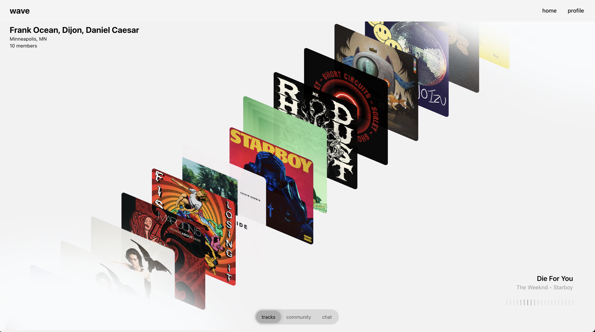

## Overview

Wave is a social platform that allows you to discover new music by sharing "ripples"
with like-minded listeners. Connect your Spotify account and start exploring music
in a new way.

<p align="center">
<br>
    
</p>

## Development

Setup your environment:

```bash
cp .env.example .env
```

Run the development server:

```bash
npm run dev
```

Open [http://localhost:3000](http://localhost:3000) with your browser to see the
result.

## Contributing

Contributions are welcome! Please feel free to submit a Pull Request.
